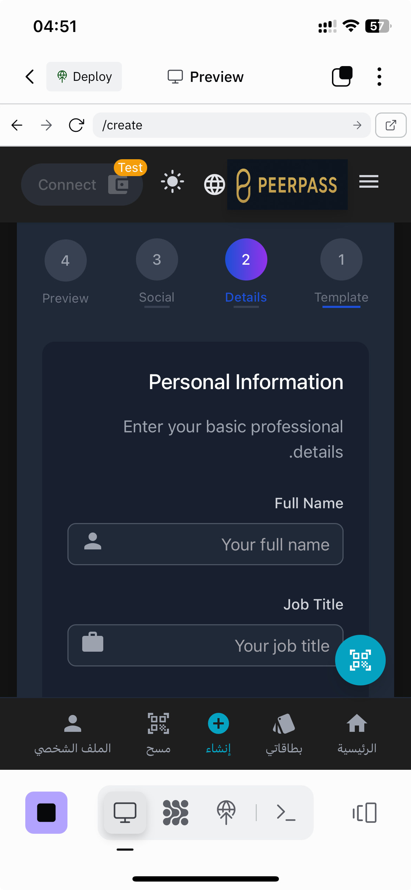
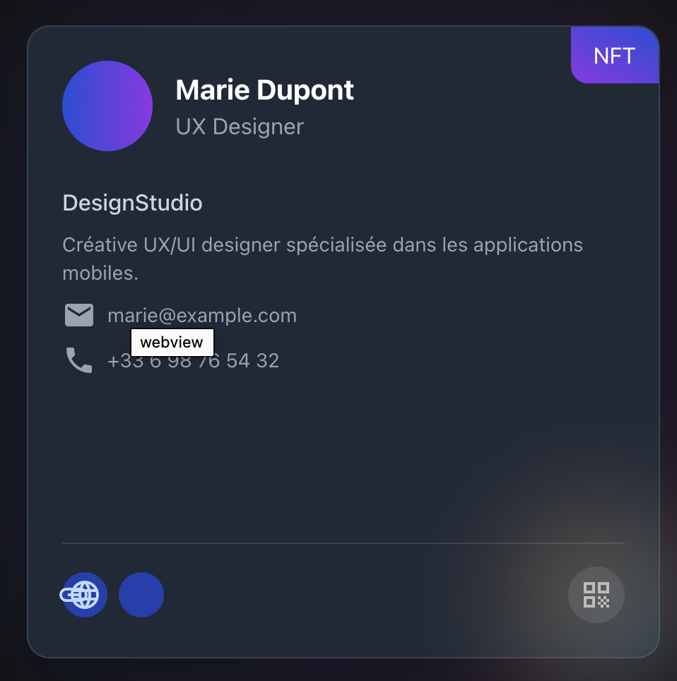

# PeerPass - Application de Cartes de Visite Web3

PeerPass est une plateforme Web3 qui révolutionne le réseautage professionnel grâce à des cartes de visite numériques personnalisées et vérifiées par la blockchain BNB Chain.

## Fonctionnalités

- **Cartes de visite digitales NFT**: Créez et partagez des cartes professionnelles sous forme de NFT
- **Authentification via Web3**: Connectez-vous avec votre portefeuille Web3 (Metamask, WalletConnect, etc.)
- **Personnalisation avancée**: Options de personnalisation complètes (typographie, couleurs, effets)
- **Interface multilingue**: Support pour l'anglais, le français et l'arabe
- **Conception mobile-first**: Expérience optimisée sur tous les appareils
- **Mode démo**: Testez l'application sans avoir à vous connecter avec un portefeuille

## Technologies utilisées

- React + Vite pour le frontend
- Express pour le backend
- Drizzle ORM avec PostgreSQL pour la base de données
- Web3.js / Ethers.js pour l'interaction avec la blockchain
- Tailwind CSS et ShadCN UI pour l'interface utilisateur
- i18next pour l'internationalisation

## Installation

1. Clonez ce dépôt
2. Installez les dépendances avec `npm install`
3. Créez un fichier `.env` basé sur `.env.example`
4. Lancez l'application avec `npm run dev`

## Déploiement

Consultez le fichier [VERCEL_DEPLOYMENT.md](VERCEL_DEPLOYMENT.md) pour les instructions détaillées sur le déploiement de l'application sur Vercel.

## Captures d'écran

## Structure du projet

- `/client`: Frontend React de l'application
- `/server`: Backend Express API
- `/shared`: Code partagé entre le frontend et le backend
- `/api`: Points d'entrée pour le déploiement sur Vercel

## Contributeurs

- Aziz Laghzaoui - Concepteur principal
- Équipe Replit

## Licence

MIT